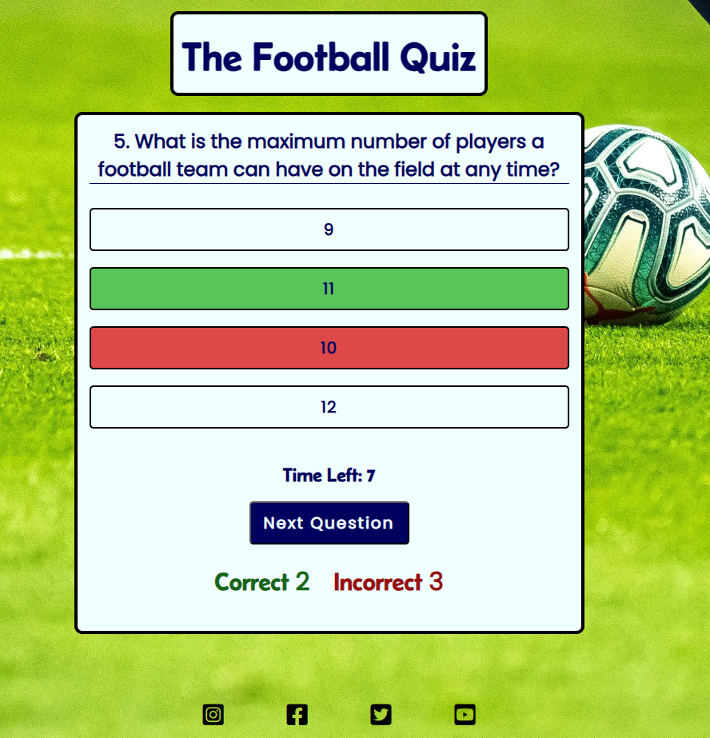

# **The Football Quiz**

This website has been built for my second portfolio project and is for education purposes only.

This is a football trivia quiz for any football fans who would like to test their knowledge on the sport.

## **Live Site**

**The Football Quiz Site is live and can be found by clicking [here](https://chrisdiggle1.github.io/football-quiz/)**

## **Table Of Contents**

- [The Football Quiz](#the-football-quiz)
    - [Table Of Contents](#table-of-contents)
    - [User Experience UX](#user-experience-ux)
        - [Site Purpose](#site-purpose)
        - [Target Audience](#target-audience)
        - [Communication](#communication)
        - [User Goals](#user-goals)
        - [Future Implementations](#future-implementations)
    - [Design](#design)
        - [Website Structure](#website-structure)
        - [Colour Scheme](#colour-scheme)
        - [Typography](#typography)
        - [Imagery](#imagery)
    - [Page Features](#page-features)
        - [Landing Page](#landing-page)
        - [Difficulty Level Page](#difficulty-level-page)
        - [Quiz Area](#quiz-area)
        - [Final Score Screen](#final-score-screen)
        - [Social Links](#social-links)
        - [404 Page](#404-page)
        - [Favicon](#favicon)
    - [Technologies Used](#technologies-used)
        - [Languages](#languages)
        - [Frameworks and tools](#Frameworks-and-tools)
    - [Testing and Validation](#testing-and-validation)
        - [W3C Markup Validation](#w3c-markup-validation)
        - [W3C Jigsaw CSS Validation](#w3c-jigsaw-css-validation)
        - [JSHint JavaScript Validation](#jshint-javaScript-validation)
        - [Lighthouse Tests](#Lighthouse-Tests)
        - [WAVE Tests](#wave-tests)
        - [Feature Testing](#feature-testing)
    - [Bugs](#bugs)
        - [Resolved Bugs](#resolved-bugs)
    - [Deployment](#deployment)
    - [Local Development](#local-development)
        - [Fork](#fork)
        - [Clone](#clone)
    - [Credits](#credits)
        - [Code](#code)
        - [Images](#images)
        - [Others](#others)
        - [Acknowledgements](#acknowledgements)

## **User Experience UX**

### **Site Purpose**

The quiz is designed to challenge users on general football trivia. There are 10 questions to answer, and for each question, the user is informed immediately if they answered the question correctly or not. When the user selects an answer, if they are correct the answer will turn green and the 'correct' counter underneath will increment by one. If the user gets the answer wrong, the selected answer will highlight red, the correct answer will be shown in green and the 'incorrect' counter will increment by one. Once the user has answered all 10 questions, a message is displayed on the screen displaying the correct number of answers and asking if they would like to take the quiz again.

### **Target Audience**

This quiz is for anybody who wants to test their general football knowledge or just wants to have a bit of fun to pass some time.

### **Communication**

The overall design of the site has been made very simple on purpose to help learn the very basics of JavaScript. When the user arrives on the site, the landing page shows 4 bullet points explaining what to expect with the quiz. Once the user clicks 'start quiz' the questions, answers and score are then displayed on the screen. The visual structure of the site makes it intuitive to navigate through the ten questions. The game displays the final score after answering the last question and gives the option to play the game again.

### **User Goals**

As a user taking the quiz, I want to be challenged on my knowledge of football and also learn the answers to the questions I got wrong. I want to be entertained for a brief time and know my final score at the end. Once the quiz has finished I would like the option to play again and see if I learnt the correct answers from the ones I got incorrect on the previous go.

### **Future Implementations**

My future plans for the site are to add a lot more questions, with the questions displaying in a random order and have 3 different difficulty levels so the quiz would be more suitable for a wider audience. I would also like to add a countdown timer to each question to add more fun and for the user to have to think quicker.

## **Design**

### **Website Structure**

### **Balsamiq Wireframes**

Questions Page Desktop

 

Questions Page Tablet

 

Questions Page Mobile

 

Score Page Desktop

 

Score Page Tablet

 

Score Page Mobile

 

### **Colour Scheme**

The colour scheme for the qame are were dicatated by the green background representing a football pitch. The white and blue I found were best for visualisation overall to display the questions and highlighting the correct and incorrect answers using red and green.

### **Typography**

The two fonts used in the site have been sourced from the Google Fonts library: 

Belanosima for the main heading

Poppins for the questions and answers

### **Imagery**

The background image of a football, pitch and players boots was sourced from unsplash and the creator is [Emilio Garcia](https://unsplash.com/photos/AWdCgDDedH0)

## **Page Features**

### **Landing Page**

The landing page contains the below features - 

* The main quiz header
* Information on the quiz, what to expect and how it works
* The button to start the quiz
* Links to social media websites

View The Landing Page

### **Difficulty Level Page**

The difficulty level displays the below Choices for the user to choose from - 

* Easy - The user will be to test their knowledge with 10 easy football related questions
* Medium - The user will be to test their knowledge with 10 medium football related questions
* Hard - The user will be to test their knowledge with 10 hard football related questions

View The Difficulty Choice Page

### **Quiz Area**

The Quiz area contains the below features - 

* The main quiz header
* The number of the question followed by the question itself
* Four possible answers
* The answers will highlight green of correct and red if incorrect
* A correct and Incorrect score which increment by one depending on the answer you give
* The 'Next Question' button once an answer has been selected
* A 10 second timer for each question
* Links to social media websites

View The Quiz Area

### **Final Score Screen**

The final Score Screen displays the below features - 

* The main quiz header
* A statement confirming how many goals (answers) you scored from 10 shots (questions)
* The total score tally showing 'correct' answers in green and 'incorrect' in red
* Button asking the user if they want anther shot at the quiz
* Links to social media websites

View the Final Score Screen

### **Social Links**

Links to social media sites are in the footer area. The icons of Instagram, Facebook, Twitter and Youtube are all clickable and open a new tab once clicked. Social media links have been used to serve the purpose of giving the user the chance of potentially reaching out and connect with the author of the site. As the website has educational purposes only, the links open the homepages of the respective social media websites.

View the Social Links

### **404 Page**

A basic custom 404.html error page has been included. The page informs the user that the URL they have input is incorrect by displaying the message: 404 - Page Not Found! Please check the URL is correct. I have inlcuded a link that takes the user back to the landing page of the site.

View the 404 Page

### **Favicon**

I have added a Favicon to site as a little extra touch to display a little image on the tab. The Favicon contains the letters 'FQ' for football quiz and uses the blue and white colours that are used in the question areaof the site.

View the Favicon

## **Technologies Used**

### **Languages**

- HTML
- CSS
- JavaScript

### **Frameworks and tools**

- [Git](https://git-scm.com/) - For version control.
- [Github](https://github.com/) - To save and store the files for the site.
- [Balsamiq](https://balsamiq.com/) - Used to create wireframes.
- [CodeAnywhere](https://app.codeanywhere.com/) - The cloud IDE used to write all my code.
- [Google Fonts](https://fonts.google.com/) - Used to import the fonts used on the site.
- [Font Awesome](https://fontawesome.com/) - The icons on the site are sourced from here.
- [Am I Responsive?](http://ami.responsivedesign.is/) Used tp show the website image on a range of devices.
- [Favicon.io](https://favicon.io/) - Used to create the favicon.
- [Google Developer Tools](https://developers.google.com/web/tools) - To troubleshoot and test features, solve issues with responsiveness and styling.
- [TinyPNG](https://tinypng.com/) - Used to compress images.
- [Unsplash](https://unsplash.com) - Used to source the background image.
- [Convertio](https://convertio.co/webp-converter/) - Used to conver the background image to webp.

## **Testing and Validation**

### **W3C Markup Validation**

- The HTML files passed through the [W3C validator](https://validator.w3.org/) with no issues found.

Index.HTML Validation

 

404.HTML Validation

 

### **W3C Jigsaw CSS Validation**

- The CSS file passed through the [Jigsaw validator](https://jigsaw.w3.org/css-validator/) with no issues found.

CSS Validation

 

### **JSHint JavaScript Validation**

- The JS files passed through [JSHint](https://jshint.com/) with no issues found.

JS Questions Validation

 

JS Validation

 

### **Lighthouse Tests**

- The page has an excellent Accessibility rating in Lighthouse for both desktop and mobile.

Desktop Lighthouse Test

 

Mobile Lighthouse Test

- The site was tested in Chrome, Edge and Safari without any issues.
- All links open to external pages as intended.

 

### **WAVE Tests**

- The WAVE test passed with no errors or contrast errors.

Wave Test

 

### **Feature Testing**

| Test                      | Expected                                  | Pass/Fail |
| ---| ---| ---|
| Open Landing Page | An event listener waits for the DOM to finish Loading before running the game. The landing page is displayed showing the user brief details about the quiz and a start button to start the quiz. | Pass |
| Click the Start Quiz button | When hovering over the 'Start Quiz' button, the colours reverse, the blue text turns white and the white background turns blue. The mouse cursor changes to a pointer. When the button is clicked the page then displays the first question and multiple answers. | Pass |
| Hovering over an answer | When hovering over an answer, the colours are reversed like the Start Quiz button and the mouser cursor also changes to a pointer again. | Pass |
| Selecting the Correct Answer | When the correct answer is selected, the answer button turns green and the 'Next Question' button is displayed| Pass |
| Selecting an incorrect answer | When an incorrect answer is selected the button turns red and the corrcect answer is immediately highlighted green and the 'Next Question' button is displayed. The answer can't be changed once selected. | Pass | 
| Click the Next Question button |  The quiz area is cleared. The subsequent question is displayed together with the four possible answers. The numbering of the questions increments by one each question. The 'Next Question' button is not displayed until an answer has been selected. | Pass |
| The 'Correct' counter | When a correct answer is selected, the Correct counter displayed under the question in green increments by 1. | Pass |
| The 'Incorrect' counter | When an incorrect answer is selected, the Inorrect counter displayed under the question in red increments by 1. | Pass |
| Clicking the Next Question Button on question 10 | When the user clicks the 'Next Question' button on question 10, the quiz are is cleared and the final score is displayed with a statement confirming how many goals the user scored from 10 shots. The 'Next Question' button changes to a button asking the user if they 'Fancy Another Shot'. The final score tally is displayed show the total 'Correct' and 'Incorrect' answers. | Pass |
| Click the 'Fancy another shot' button | When the user clicks the 'Fancy another shot' button, the quiz area is loaded again displaying the first question with the 4 possible answers. | Pass |
| Run through the quiz by selecting random answers one after the other until the last one | The question number increments by one each question. | Pass |
| Click the Instagram Icon | When clicked, the user will be directed to the Instagram homepage in a new tab. | Pass |
| Click the Facebook Icon | When clicked, the user will be directed to the Facebook homepage in a new tab. | Pass |
| Click the Twitter Icon | When clicked, the user will be directed to the Twitter homepage in new tab. | Pass |
| Click the Youtube Icon | When clicked, the user will be directed to the Youtube homepage in new tab. | Pass |

## **Bugs**

### **Resolved Bugs**

| Problem                       | Fix   |
| ---| ---|
| The site was opening up straight to the questions and answer pages and not the landing page. | I added in an Event Listener for DOMContentLoaded to prevent the startQuiz function from executing before the HTML has finished loading. |
| Console error A console error generated on line 156 on the script file, startQuiz is not defined.  | Removed the DomContentLoaded event listener entirely as the script is loaded at the end of the HTML file. |
| If the user selected 'Fancy another shot' at the end of their game, the next question button had changed to 'Fancy another shot' for every question. | Reset the 'Next Question' button to its original state for the start of a new game by adding nextButton.innerHTML = 'Next Question'; to the startGame function. |

## **Deployment**

1. Login to GitHub.
2. Select the repository for the site you wish to deploy.
3. Click on "Settings" on the navigation bar under the repository title.
4. Click on 'pages' shown on the left side navigation bar.
5. Under the 'build and deployment' title, and the 'branch' heading, use the drop down and select 'main'.
6. Select the /root folder to deply from.
7. Click "Save", then wait for it to be deployed. Please note it can take some time for the page to be fully deployed.
8. The URL for the deployed site will be shown above 'source'.

### **Local Development**

### **Fork**

To Fork the repository, please follow the below steps - 

1. Login to GitHub.
2. Select the repository for the project you wish to fork.
3. Click the fork botton in the top right-hand corner.

### **Clone**

To clone the repository, please follow thw below steps - 

1. Login to GitHub.
2. Select the repository for the project you wish to clone.
3. Click on the code button and choose whether you would like to clone with HTTPS, SSH or GitHub CLI and copy the link shown.
4. Open a new terminal in the IDE used and change the current working directory to the location you want to use for the cloned directory.
5. Type 'git clone' into the terminal and then paste the link you copied in step 3 then press enter.

## **Credits**

### **Code**

- The basic structure of the quiz code used was inspired by YouTube videos by [Easy Tutorials](https://www.youtube.com/watch?v=PBcqGxrr9g8) and [Web Dev Simplified](https://www.youtube.com/watch?v=riDzcEQbX6k)
- Certain aspects of the code were inspired by the Love Maths Walkthrough Project from the Code institute.

### **Images**

- The background image of a football pitch, football and players boots was sourced from Unsplash and the author is [Emilio Garcia](https://unsplash.com/photos/AWdCgDDedH0)

### **Others**

- The questions used in the quiz were sourced from [Quiz Trivia Games](https://www.quiztriviagames.com/football-quiz/)

### **Acknowledgements**

I would like to thank the below during my time doing this project -

- The Code Institute Student Care for allowing me time off the course for personal reasons.

- My Wife and Kids for their always continued support.

- The Slack community for when you need help, a laugh or to help somebody else out. 

- The Site has been built for educational purposes only.